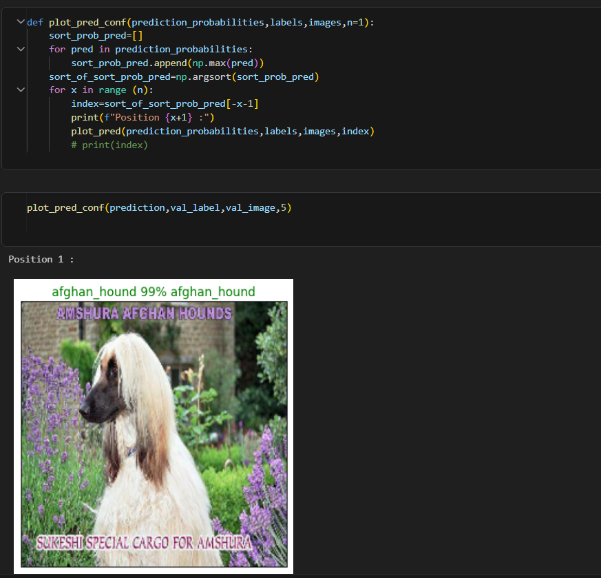
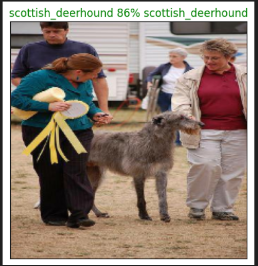

# Dog_Breed_Classification
This is my first project which use TensorFlow CNN (mobilenet-v2) to identify the breed of Dogs.
I got score of 1.2034 at Kaggle competition. I know it is not the est but for first project its nice.
The dataset used is (https://www.kaggle.com/competitions/dog-breed-identification/overview)

#### Here are some Example of Working

##Thanks for visiting